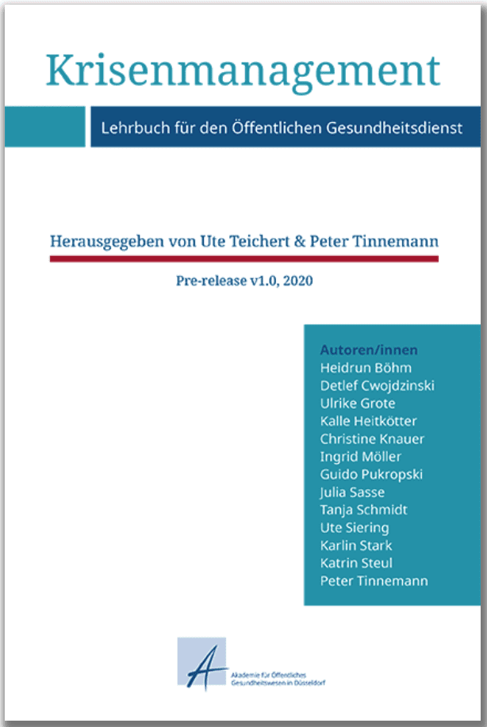
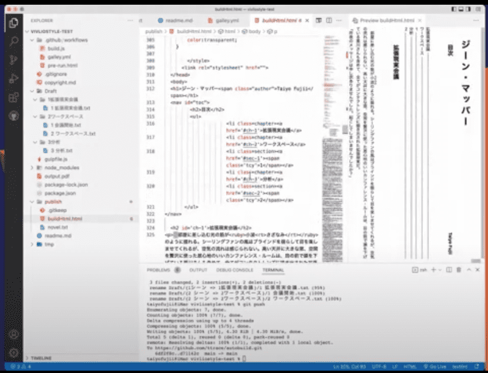
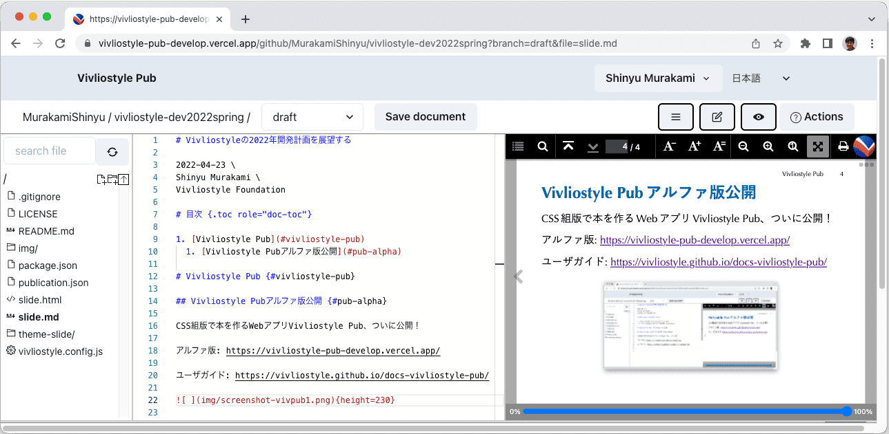
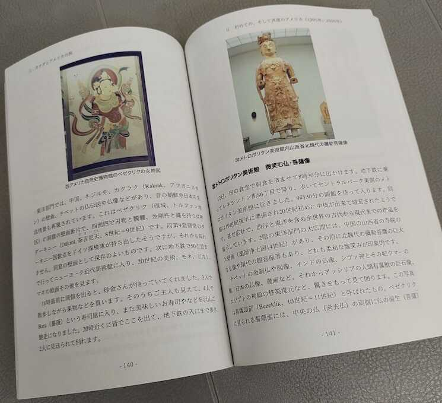

# 楽しくCSS組版を実現するオープンソースプロジェクト {.cover}

第63回出版UD研究会 2022-08-06 \
村上 真雄 (murakami@vivliostyle.org) \
一般社団法人ビブリオスタイル代表理事

# 目次 {.toc role="doc-toc"}

- [CSS組版＝アクセシブルなWeb技術で本が作れる](#css組版アクセシブルなweb技術で本が作れる)
  - [CSS組版とは](#css組版とは)
  - [ワンソース・マルチユースの出版に](#ワンソースマルチユースの出版に)
- [Vivliostyle: ブラウザで動くオープンソースのCSS組版ツール](#vivliostyle-ブラウザで動くオープンソースのcss組版ツール)
  - [CSS組版はかなり前から実現していたが…](#css組版はかなり前から実現していたが)
  - [Webブラウザを利用した組版](#webブラウザを利用した組版)
  - [オープンソース開発コミュニティー](#オープンソース開発コミュニティー)
  - [Vivliostyle利用事例の紹介](#vivliostyle利用事例の紹介)
- [CSS組版をもっと簡単にするためのプロジェクトVivliostyle Pub](#css組版をもっと簡単にするためのプロジェクトvivliostyle-pub)
  - [今のVivliostyle CSS組版ツール](#今のvivliostyle-css組版ツール)
  - [今のCSS組版ツールはエンジニアではない一般の人にとっては難しい](#今のcss組版ツールはエンジニアではない一般の人にとっては難しい)
  - [ブラウザだけで本が作れるWebアプリVivliostyle Pub開発中](#ブラウザだけで本が作れるwebアプリvivliostyle-pub開発中)
  - [Vivliostyle Pubでできること](#vivliostyle-pubでできること)
  - [Vivliostyle Pubで作った本の印刷製本に](#vivliostyle-pubで作った本の印刷製本に)
  - [まだアルファ版だけど、よろしければどうぞ](#まだアルファ版だけどよろしければどうぞ)
  - [開発が順調に進むように、応援よろしく！](#開発が順調に進むように応援よろしく)

# 自己紹介 {.intro}

{一般社団法人ビブリオスタイル|　　　Vivliostyle Foundation　　　}　代表理事　{村上 真雄|むらかみ しんゆう}

- 1990年ごろ、テキスト整形ツールXTRを開発、公開。それ以来マークアップ言語と組版に関心
- 1999〜2014年、アンテナハウスAH Formatterの開発に従事
- 2014年、株式会社ビブリオスタイル設立。CSS組版ソフトウェアVivliostyle開発プロジェクト開始
- 2018年、[一般社団法人ビブリオスタイル](https://vivliostyle.org/ja/)設立。Vivliostyleをコミュニティーベースでのオープンソース開発に移行

# CSS組版＝アクセシブルなWeb技術で本が作れる

## CSS組版とは

CSS組版とは、Webページを記述するのに使われるHTMLとCSSで、本のページの組版を可能にする技術。

- HTML：文書の内容のテキストや論理的な構造を記述
- CSS：文書のスタイル（どのように見せるか）を定義

電子書籍の標準形式であるEPUBも、その中身はHTMLとCSS。（それにその他の必要なファイルをまとめてzip形式で圧縮したもの）

WebもEPUBも、アクセシビリティがとても重視されている。

## ワンソース・マルチユースの出版に

CSS組版によりHTMLとCSSで紙の本も作れるということは、
- Web出版、電子出版、印刷出版すべてHTML+CSSでできる  
  →ワンソース・マルチユースで多様なニーズに対応可能！

読み手のニーズに合わせてスタイル(CSS)を変えられる。例：

- 文字を大きくしたり、読みやすいフォントに変える
- 色をハイコントラストにする
- 縦書きの本を横書きに変える
- 総ルビにする、分かち書きにする、etc.

# Vivliostyle: ブラウザで動くオープンソースのCSS組版ツール

## CSS組版はかなり前から実現していたが…

Vivliostyleが生まれる前から、CSS組版は一部では実用化されていた。

例えば、XML文書自動組版に利用されているアンテナハウスAH Formatterは、XML専用の組版仕様とともにCSS組版もサポートしており（2009年から）、有名なところでは米オライリー社の書籍制作システムに組み込まれて利用されている。

しかし、それは個人が気軽に使える製品ではない。  
→CSS組版の普及には、だれでもオープンに使えるものが必要

## Webブラウザを利用した組版

現在のWebブラウザには、HTML+CSSでの高度なレイアウト機能が備わる。印刷機能を持ち、PDF出力も可能。  
→ブラウザだけでもCSS組版は可能！

しかし、本のページの組版のための機能はCSSのドラフト仕様はあっても（[CSS Paged Media仕様](https://www.w3.org/TR/css-page-3/)など）ブラウザにはなかなか実装されない。

それなら足りないCSSの組版機能をJavaScriptで実装して、本の組版もブラウザで可能にしよう →Vivliostyleプロジェクト

## オープンソース開発コミュニティー

2018年から現在の開発体制：コミュニティーベースでオープンな開発。その管理のため一般社団法人ビブリオスタイル設立。

ボランティアの開発貢献者たちにより開発が進んでいる。  
主なコミュニティー活動：

- [Slackコミュニティー](https://vivliostyle.org/ja/community/#slack)と[GitHub](https://github.com/vivliostyle)上で開発の議論
- 毎月の開発者会議の開催: [これまでの議題・議事録](https://github.com/vivliostyle/community/issues?q=label%3Ameeting)
- 年2回[「Vivliostyleユーザーと開発者の集い」を開催](https://vivliostyle.connpass.com/)
  - 利用事例の発表、開発状況の報告、開発の議論
  
## Vivliostyle利用事例の紹介

年2回の「Vivliostyleユーザーと開発者の集い」でこれまで発表されたVivliostyle利用事例から：

- {.float-right height="180"}「マンガでわかるRuby」のCSS組版・制作秘話（湊川あい＋よう）／[開発者とユーザーの集い 2019夏](https://connpass.com/event/141767/)

- {.float-right height="180"}COVID-19に対する公衆衛生教科書の迅速な出版（ドイツ)／[ユーザーと開発者の集い 2020秋](https://vivliostyle.connpass.com/event/189940/)
  - 関連記事：[ドイツ国立科学技術図書館が Vivliostyle により、COVID-19対策の公衆衛生教科書を出版](https://vivliostyle.org/ja/blog/2020/04/10/tib-book-against-covid19/)
- {.float-right height="180"}商業出版『そろそろ常識？マンガでわかる「正規表現」』の制作（大津雄一郎）／[ユーザーと開発者の集い 2020秋](https://vivliostyle.connpass.com/event/189940/)
- {.float-right height="180"}小説執筆におけるVivliostyle活用（藤井大洋）／[ユーザーと開発者の集い 2022春](https://vivliostyle.connpass.com/event/243092/)

# CSS組版をもっと簡単にするためのプロジェクトVivliostyle Pub

## 今のVivliostyle CSS組版ツール

これまでのVivliostyleプロジェクトの中心は、CSS組版を実現するJavaScriptライブラリ[Vivliostyle.js](https://github.com/vivliostyle/vivliostyle.js)と、それを使うための以下のツール：

- Vivliostyle Viewer：組版プレビュー用、また電子出版ビューアとしても使える
  - [Vivliostyleサイトのサンプルページ](https://vivliostyle.org/ja/samples/)で、Vivliostyle Viewerでの組版サンプルの閲覧ができる
- Vivliostyle CLI: 色々使えるCSS組版ツール  
（CLI＝コマンドライン・インターフェース）
  - macOSやLinuxやWindowsのターミナル上で使用できる
  - 色々な自動処理や、他のシステムに組み込んで利用できる
  - 関連するVivliostyleツール：
    - Vivliostyleテーマ ([Vivliostyle Themes](https://github.com/vivliostyle/themes)): CSS組版スタイルシートをパッケージとして公開／再利用する仕組み
    - [VFM: Vivliostyle Flavored Markdown](https://github.com/vivliostyle/vfm): CSS組版用のマークダウン記法
    （テキストに簡単な記号を入れて見出しや箇条書きを表現できてHTMLに変換できるもの）
  - [Create Book](https://github.com/vivliostyle/create-book): Vivliostyle CLIの導入用ツール

## 今のCSS組版ツールはエンジニアではない一般の人にとっては難しい

- HTMLとCSSの知識が必要
  - HTMLを直接書かなくていいようにマークダウン記法をサポートしているが、それでも最低限のHTMLのタグの知識は必要。
- コマンドラインでの操作
  - コマンドラインのツールであるVivliostyle CLIを使うのはエンジニアではない一般の人にとってはハードルが高い。

## ブラウザだけで本が作れるWebアプリVivliostyle Pub開発中

アルファ版：https://vivliostyle-pub-develop.vercel.app/

{height=210}

## Vivliostyle Pubでできること

- 無料、インストール不要、Webブラウザだけで本が作れる
- 組版結果をプレビュー確認しながら執筆・編集ができる
- マークダウン記法で原稿が書ける
- ページデザインは、テーマから選べる
  - 既存テーマをカスタマイズしたり自分でCSS書いてもよい
- Webフォント対応
- GitHub利用。原稿変更履歴がGitHubに保存される
- 多数の原稿からなる出版物制作、その共同編集作業も可能
- PDF出力、Web出版物(WebBook)、EPUB生成（予定）

## Vivliostyle Pubで作った本の印刷製本に

{.float-right height="150"}Vivliostyle Pubで作った本の印刷製本がスムーズにできるよう、印刷製本サービスのmybooks POD（欧文印刷株式会社）と提携あり→ https://pod.mybooks.jp/

ほかでも、同人誌印刷を扱っている印刷所ならばVivliostyle Pubで出力したPDFからの印刷・製本が可能なはず。

## まだアルファ版だけど、よろしければどうぞ

現状はまだアルファ版（＝開発途上だけどテストのために公開したもの）で、まだできていない機能が多い：

- スタイル・テーマの設定とカスタマイズを簡単に
- 目次作成を簡単に
- 表紙の作成を簡単に
- 印刷用PDFと閲覧用PDFなど、目的別のPDF出力の設定
- EPUB生成機能、EPUBやWeb出版物での作品公開を簡単に
- 出版物メタデータの設定・編集機能

CSS組版をもっと簡単にして、だれもが使えるものにするのが目標だけれども、今のアルファ版の現状ではまだまだ難しい。

当面は「CSS組版」の知識がある程度あるような人たちに（技術同人誌を作る人たちなど）に使ってもらいながら開発を進めて、目標に近づけたい。

よろしければ、Vivliostyle Pubアルファ版を使ってみてください→https://vivliostyle-pub-develop.vercel.app/

GitHubアカウントが必要だけれども、[Vivliostyle Pubアルファ版ユーザーガイド](https://vivliostyle.github.io/docs-vivliostyle-pub/#/ja/)で、その取得方法から説明してます。

## 開発が順調に進むように、応援よろしく！

Vivliostyleはボランティアで開発されているオープンソース・プロジェクト。開発協力者を募集してます！

- コミュニティ→ https://vivliostyle.org/ja/community/

Vivliostyleのサービスやプロダクトのビジネス利用も歓迎。その相談やサポートについてはお問合せください。→メール窓口<mail@vivliostyle.org>

私たちについて→ https://vivliostyle.org/ja/about-us/
